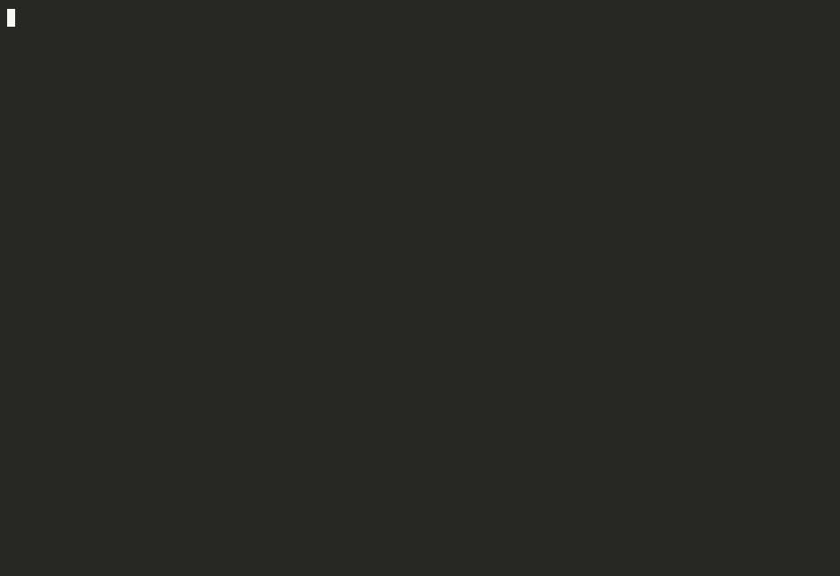
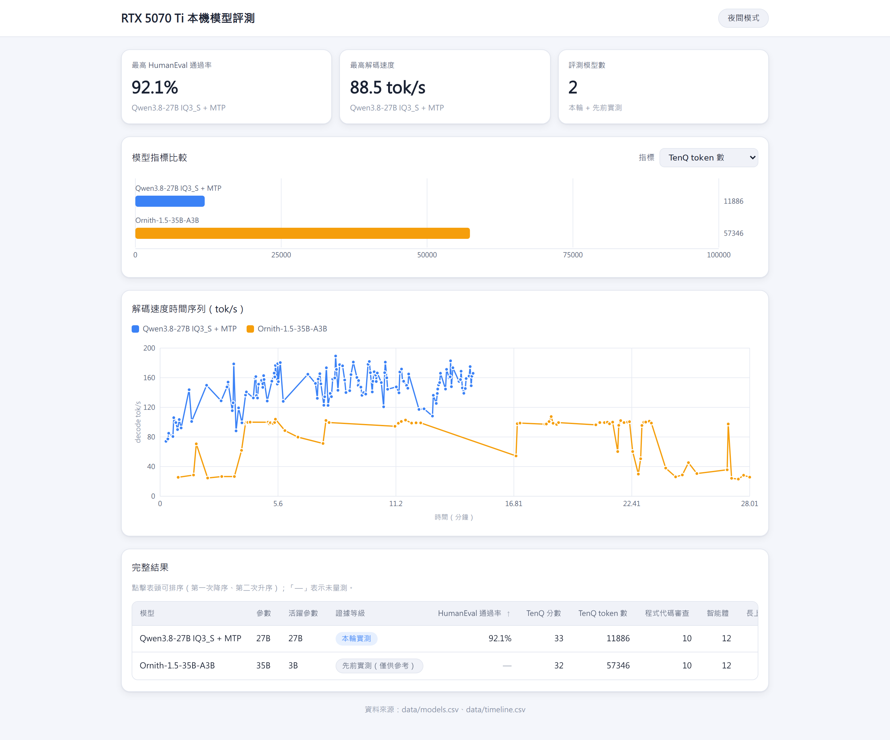
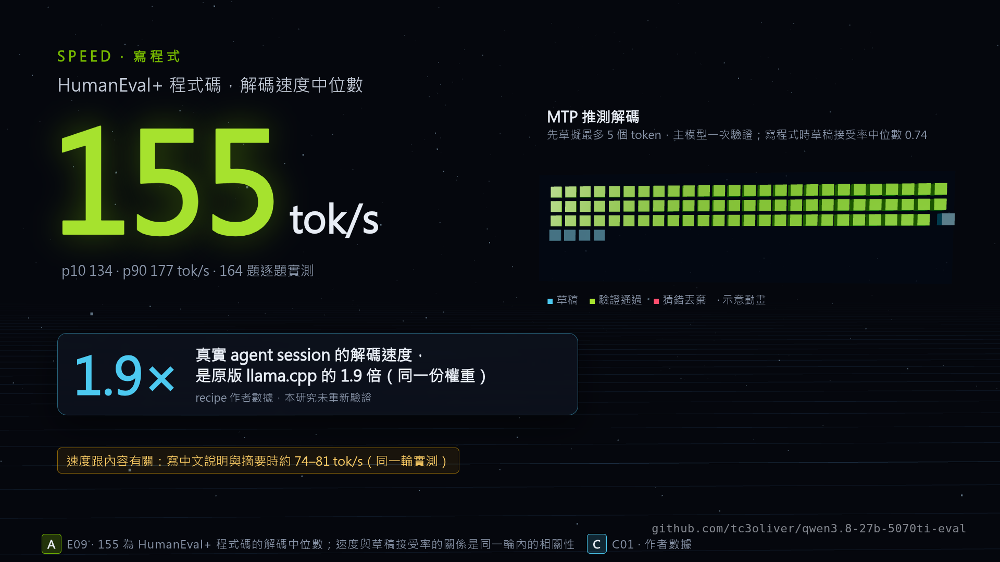

# Qwen3.8-27B 跑在 RTX 5070 Ti：最快的 recipe，品質也最好嗎？

[English](README.md) | **繁體中文** | [简体中文](README.zh-CN.md)


[](LICENSE-CONTENT.md)

[feveromo recipe](https://github.com/feveromo/recipes-qwen3.8-27b-5070ti) 讓 27B 模型可以塞進 16 GB 的顯示卡。
作者的數據是：同樣的權重、實際的 agent session，decode 速度是原版 llama.cpp 的 1.9×
（[C01](EVIDENCE-INDEX.md)）。速度早就有答案了。這個 repo 想回答的是另一件事：只用一張
RTX 5070 Ti，從寫程式、agent、中文長文件和延遲來看，它是不是你該跑的模型？要在桌機 GPU 上
老老實實測出答案，又得下哪些功夫？

**狀態：第 1 輪（2026-10-03）。** 受測模型已經有一次完整、有效的測試結果。第一個對手模型那次測試因 VRAM spill 作廢，
正在重跑。所以第 1 輪**沒有任何比較性的結論**，只有受測模型的測量結果，以及我們在這張卡上學到的測量經驗。

<p align="center">
  
</p>

<p align="center"><i>本機模型驅動的 <a href="https://github.com/badlogic/pi-mono">Pi</a> coding agent，
花 5 分 20 秒把這次研究的結果做成 dashboard。評分器先用參考解答驗證過，這份 dashboard 的 20/20 項檢查全部通過
（只跑一次，等級 B，<a href="EVIDENCE-INDEX.md">E30, E31</a>）：</i></p>

<p align="center">
  
</p>

**影片（51 秒）：**[第 1 輪重點](media/qwen38-5070ti-round1.mp4)，用 TypeScript + three.js 逐格渲染，畫面上每個數字都標了證據編號（[`video/`](video/)）。

<p align="center"><a href="media/qwen38-5070ti-round1.mp4"></a></p>

## 主要發現

每項結論都連到 [`EVIDENCE-INDEX.md`](EVIDENCE-INDEX.md)，從那裡可以找到原始資料。**A** = 照預先註冊的協定測得；
**B** = 在這裡測的，但不在協定範圍內（只當參考，不拿來排名）。詳見 [`EVIDENCE.md`](EVIDENCE.md)。

1. **只用一張 16 GB 顯示卡，受測模型的 HumanEval+ 拿到 92.1 %**（151/164，95 % CI 86.9–95.3）。刻意埋的 10 個
   bug 全部找到，原因也都說對；12/12 個工具呼叫 episode 全部完成，沒有一次格式錯誤；60K token 的中文文件裡
   埋了四個事實，全部找回；日常中文提示 1.45 s（p50）就開始回答。[E01–E07, A]
2. **同一個模型，寫程式的速度大約是寫中文的兩倍。** Decode 速度跟著 speculative decoding 的 draft 接受率走：
   HumanEval+ 的接受率中位數是 0.74，decode 155 tok/s；中文解說和摘要的接受率只有 0.28–0.41，
   decode 74–81 tok/s。recipe 附的 draft 詞表是拿英文文字和程式碼排出來的。
   [E09, A — 同一次測試內的相關性]
3. **同一個提示，temperature 0 也沒有得到相同輸出。** 用 recipe 的自適應 draft 長度，對剛啟動的伺服器送同一個
   請求，回來的長度分別是 885、918、1,219、962 和 918 個 token。把 draft 長度固定之後，五次都是 3,080 個 token。
   一台已經連續跑了好幾個小時的伺服器（還是自適應）也給出一模一樣的輸出，我們推斷它的控制器已經收斂到同一個寬度，
   不過寬度沒有記錄下來。兩種跑法的答案不一樣（5 和 7）。只測了一個提示，每種條件跑五次。[E25, B]
4. **「載得起來」不等於「能用」。** context 開到 131,072 token 時，受測模型載得起來，測試請求的 decode 是
   5.9 tok/s。開到 122,880 時，共享記憶體計數器顯示 485 MiB，decode 只剩 6–8 tok/s；我們認為是 Windows
   驅動程式把放不下的部分丟到系統 RAM。64K 是能正常運作的最大設定。有一個 MoE 對手模型通過了設定檢查，跑到一半
   spill 又變多，速度在 99 到 27 tok/s 之間大幅擺盪。那次測試作廢、不納入比較（輸出有保留），harness 現在也改成
   每分鐘取樣一次 spill。[E21, E23, B]
5. **thinking budget 的初步線索。** 我們在推理題組上做了一輪掃描，每個設定只跑一次（token 預算 4×）。廠商預設的
   effort `xhigh` 用了 25,688 個 token，得 30/40；effort `medium` 加一行 short-think 指示，用了 9,878 個
   token，得 35/40。`xhigh` 有五個答案撞到 token 上限，而同樣的 `medium` 設定在第 1 輪的正式測試拿到 33/40。
   所以這裡看得出 token 成本，但還不能證明品質誰高誰低。[E24, B]

## 第 1 輪結果（2026-10-03）

| | Qwen3.8-27B IQ3_S + MTP（受測模型） | Ornith-1.5-35B-A3B (MoE) |
|---|---:|---:|
| 證據等級 | **A** | **B** — VRAM spill，結果作廢 |
| HumanEval+ pass@1 (164) | **92.1 %** (86.9–95.3) | —（停在 32/164） |
| 10Q 推理，跑 1 次 | 33/40，11,886 tokens | 32/40，57,346 tokens |
| 程式碼審查（埋了 10 個 bug） | 10/10 | 10/10 |
| Agent 工具呼叫 | 12/12，0 次格式錯誤 | 12/12，0 次格式錯誤 |
| 長 context 召回 16K / 32K / 60K | 4/4 · 4/4 · 4/4 | 4/4 · 4/4 · 4/4 |
| 60K 提示：prefill、第一個 token | 1,689 tok/s，39.4 s | 無效 |
| 日常中文提示：第一個回答 token p50 / p90 | 1.45 s / 2.46 s | 無效 |
| Decode，中文文章 / 程式碼 | 平均 88.5 tok/s（74–106）/ 中位數 155 tok/s | 無效 |

**Coding agent，只跑一次（等級 B）：** Pi 搭配受測模型花 320 s 完成 dashboard 任務：28 個回合、27 次工具呼叫、
0 次工具錯誤、25,678 個輸出 token，評分器檢查 20/20（[E30](EVIDENCE-INDEX.md)）。

原始結果：[`results/`](results/) · 彙整表：[`results/arena-2026-10-summary.md`](results/arena-2026-10-summary.md)。
另外四個組態（官方非 abliterated 權重、Unsloth 量化版、Muse-Glimmer-30B、Ornith-1.5-9B）的設定已經凍結，正在排隊。
Ornith-35B 重跑時會用它的下一個預先註冊的設定。設定搜尋階段已經測到：社群預設的 Unsloth UD-Q3_K_XL
（13.15 GB，原版 llama.cpp）在 48K 和 64K 會 spill 452–484 MiB，只有 32K 能用；recipe 的 IQ3_S
（12.12 GB）則塞得下 64K。不過兩套設定的差別不只檔案大小，品質也沒有測。[E20, A]

## 怎麼測的

- **預先註冊。** 在跑任何比較之前，[`PROTOCOL.md`](PROTOCOL.md) 就先定好了測試套件、設定搜尋方式，以及
  「最佳」怎麼定義。之後每一次變更或偏離都記在裡面並寫明理由，作廢的測試也都留在 repo 裡。
- **每個模型用自己的設定。** 每個模型都用自己 model card 上的 sampler 和推理模式。例外是受測模型和它的官方權重
  對照組，這兩個用調過的 effort-`medium` + short-think 設定（見「限制」）。context 大小從一份固定清單裡挑：從 64K
  開始，取第一個 spill 不超過 300 MiB 就能載入的值，spill 以 Windows 驅動程式的計數器為準。
  Speculative decoding 照各模型自己公開的用法。所有設定都在跑測試套件之前寫進 `frozen.json` 凍結。
- **測試套件。** HumanEval+（164 題全跑，實際執行）、20 題手寫的中文推理題（用程式評分）、10 題埋了 bug 的
  程式碼審查、多輪工具呼叫（真的執行工具，並偵測洩漏）、在 16K–60K token 的繁體中文維基百科文字裡找 needle、
  日常中文提示的串流延遲，以及一個用瀏覽器評分器的 coding agent 任務。
- **評分器先測過才拿來用。** HumanEval+ 檢查器能讓全部 164 個標準解答通過 [E32]。六個 Python/SQL 埋入的 bug 實際
  跑過都能重現（另外四個 JS/Go/C 的沒有跑）[E33]。10Q 評分器跟之前的人工評分比過：一次一致，另一次
  有一題（Q8）不同，記錄在 `PROTOCOL.md`。Q8 和 Q9 標記為待人工複查，在 33/40 裡是以未複查的狀態計分。dashboard
  評分器讓參考解答 20/20 通過，也抓到了故意弄壞的副本裡全部六個缺陷 [E31]。

## 重現

```bash
git clone https://github.com/tc3oliver/qwen3.8-27b-5070ti-eval && cd qwen3.8-27b-5070ti-eval
data/fetch.sh                                   # HumanEval+ (checksum verified)
data/fetch_models.sh ~/models                    # pinned GGUF revisions, SHA-256 verified
# build llama.cpp: the recipe's instructions for the subject, stock master for the others (ENVIRONMENT.md)
python3 harness/run_arena.py --quick qwen38-27b-iq3s   # --quick = round 1's time-boxed subset; omit for the full scope
python3 harness/summarize.py                           # results/<run>-summary.md
```

建置路徑在 `harness/run_arena.py` 開頭設定。測試期間 runner 會先停掉名為 `llm-chat` 的正式服務，跑完再重新啟動。
如果你的服務名稱不一樣，請改 `PROD_SERVICE`。

## 限制與已知偏差

- 只有一台機器，Windows 11 + WSL2，桌面也共用這張顯示卡，所以絕對速度和 context 上限都比純 Linux 低
  （recipe 作者在純 Linux 上跑到 128K [C01，已發表，未重新驗證]）。
- 第 1 輪有時間限制：10Q 和程式碼審查各只跑一次、12 個 agent episode、10 個延遲提示。HumanEval+ 用正式環境的
  sampler（temperature 1.0）每題只取樣一次，不是 greedy。60K 那題用 `max_tokens` 4,967 跑。
- 受測模型的推理設定是在協定定案前、用 10Q 題組調出來的，所以在 10Q 上對它有利。10Q 題目是在這台機器上測之前的
  模型時寫的。HumanEval+ 可能出現在訓練資料裡。
- 受測模型的 spill 只在測試前後取樣，每分鐘一次的監控是之後才加上的。
- Pi 跑完之後，dashboard 評分器又收緊了兩次（18/18 → 19/19 → 20/20）。TASK.md 有把所有 selector 都給模型，
  所以只有評分器的程式碼是藏起來的。10 個延遲測試的回答裡，有 1 個跑成了簡體中文。
- Gemma-4-26B-A4B 和 gpt-oss-20b 沒有測（不再下載新模型），公開的數據可以看候選模型調查。

## 致謝

建置方式、CUDA patch、啟動參數和 draft 詞表：
[feveromo/recipes-qwen3.8-27b-5070ti](https://github.com/feveromo/recipes-qwen3.8-27b-5070ti)（這裡沒有重新散布）。
權重：[huihui-ai](https://huggingface.co/huihui-ai/Huihui-Qwen3.8-27B-abliterated-GGUF)、
[ISTA-DASLab](https://huggingface.co/ISTA-DASLab/Qwen3.8-27B-GSQ-RCO-GGUF)、[Unsloth](https://huggingface.co/unsloth/Qwen3.8-27B-GGUF)、
[SC117](https://huggingface.co/SC117/Ornith-1.5-35B-A3B-MTP-APEX-GGUF)。Coding agent：[Pi](https://github.com/badlogic/pi-mono)。
Benchmark：[EvalPlus HumanEval+](https://github.com/evalplus/evalplus)。填充用文字：中文維基百科（CC BY-SA 4.0）。
影片配樂：原創，由 [`video/scripts/music.ts`](video/scripts/music.ts) 用程式合成。

## 授權與引用

程式碼用 Apache-2.0；文字、結果和手寫資料用 CC BY 4.0（[`LICENSE-CONTENT.md`](LICENSE-CONTENT.md)）。
如果用到這些結果，請引用 [`CITATION.cff`](CITATION.cff)，引用數字時也請一起附上證據等級。
